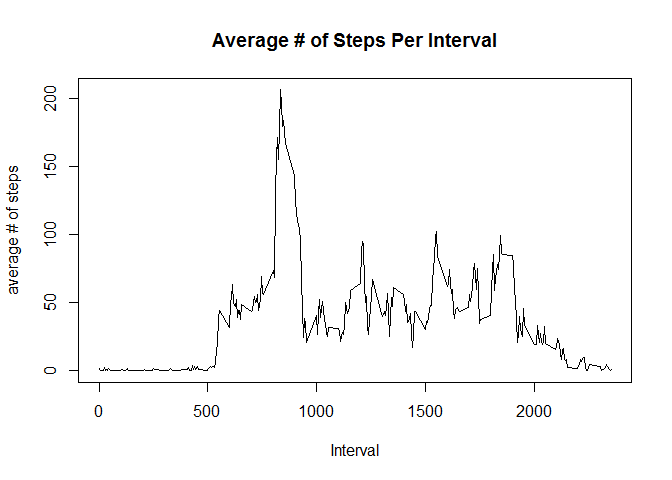

# Reproducible Research: Peer Assessment 1


## Loading and preprocessing the data
Read the data file:

```r
setwd("~/Rworkspace/Reproducible_Research/Peer_Assignment_1/RepData_PeerAssessment1")
activityDataRaw <- read.csv(file = 'activity.csv')
## strip the NA values
activityData <- na.omit(activityDataRaw)
```


## What is mean total number of steps taken per day?
The frequency of total steps per day:

```r
library(reshape2)
## calculate total steps per day
totalStepsPerDay <- dcast(data = activityData, formula = date ~ "totalSteps", 
                          fun.aggregate = sum, value.var="steps")
hist(totalStepsPerDay$totalSteps, xlab = "Total Steps per Day", 
     main = "Frequecy of Total Steps per Day")
```

<!-- -->

The mean # of total steps per day:

```r
meanTotalStepsPerDay <- mean(totalStepsPerDay$totalSteps, na.rm = TRUE)
meanTotalStepsPerDay
```

```
## [1] 10766.19
```


The median # of total steps per day:

```r
medianTotalStepsPerDay <- median(totalStepsPerDay$totalSteps, na.rm = TRUE)
medianTotalStepsPerDay
```

```
## [1] 10765
```


## What is the average daily activity pattern?
Make a time series plot (i.e. type = "l") of the 5-minute interval (x-axis) and the average number of steps taken, averaged across all days (y-axis)

```r
## calculate average steps per interval
meanStepsPerInterval <- dcast(data = activityData, formula = interval ~
                        "meanSteps", fun.aggregate = sum, value.var="steps")
plot(x = meanStepsPerInterval$interval, y = meanStepsPerInterval$meanSteps, 
     type = 'l', xlab = 'Interval', ylab = 'average # of steps', main =
           'Average # of Steps Per Interval')
```

<!-- -->


Which 5-minute interval, on average across all the days in the dataset, contains the maximum number of steps?

```r
## interval with max steps
meanStepsPerInterval[which.max(meanStepsPerInterval$meanSteps),1]
```

```
## [1] 835
```


## Imputing missing values
Note that there are a number of days/intervals where there are missing values (coded as NA). The presence of missing days may introduce bias into some calculations or summaries of the data.

Calculate and report the total number of missing values in the dataset (i.e. the total number of rows with NAs)

The number of rows with NA valeus are:

```r
## count the number of rows with NA values
nrow(subset(activityDataRaw, is.na(activityDataRaw$steps)))
```

```
## [1] 2304
```


Devise a strategy for filling in all of the missing values in the dataset. The strategy does not need to be sophisticated. For example, you could use the mean/median for that day, or the mean for that 5-minute interval, etc.
Create a new dataset that is equal to the original dataset but with the missing data filled in.

```r
## fill in the NA values with the mean values for that interval
## intialize new data frame
adjustedData <- activityDataRaw
## update NA values with meanStepsPerInterval
for (i in seq_len(nrow(adjustedData))){
      if (is.na(adjustedData[i, 'steps'])){
            adjustedData[i, 'steps'] <- meanStepsPerInterval[meanStepsPerInterval$interval == adjustedData[i, 'interval'],2]
      }
      
}
```


Make a histogram of the total number of steps taken each day and Calculate and report the mean and median total number of steps taken per day. 
Do these values differ from the estimates from the first part of the assignment? What is the impact of imputing missing data on the estimates of the total daily number of steps?

```r
library(reshape2)
## calculate total steps per day
totalAdjStepsPerDay <- dcast(data = adjustedData, formula = date ~ ., 
                          fun.aggregate = sum, value.var="steps")
hist(totalAdjStepsPerDay[,2], xlab = "Total Steps per Day", 
     main = "Frequecy of Total Adjusted Steps per Day")
```

<!-- -->

The mean # of total adjusted steps per day:

```r
meanTotalAdjStepsPerDay <- mean(totalAdjStepsPerDay[,2], na.rm = TRUE)
meanTotalAdjStepsPerDay
```

```
## [1] 84188.07
```


The median # of total adjusted steps per day:

```r
medianTotalAdjStepsPerDay <- median(totalAdjStepsPerDay[,2], na.rm = TRUE)
medianTotalAdjStepsPerDay
```

```
## [1] 11458
```


## Are there differences in activity patterns between weekdays and weekends?

For this part the weekdays() function may be of some help here. Use the dataset with the filled-in missing values for this part.

Create a new factor variable in the dataset with two levels - "weekday" and "weekend" indicating whether a given date is a weekday or weekend day.

```r
adjustedData$dayClass <- ifelse((weekdays(as.Date(adjustedData$date)) %in% c('Sunday', 'Saturday')), 'weekend', 'weekday')
```


Make a panel plot containing a time series plot (i.e. type = "l") of the 5-minute interval (x-axis) and the average number of steps taken, averaged across all weekday days or weekend days (y-axis). See the README file in the GitHub repository to see an example of what this plot should look like using simulated data.

```r
meanStepsPerAdjInterval <- dcast(data = adjustedData, formula = interval +
                        dayClass ~ "totalSteps", fun.aggregate = sum, value.var="steps")

library(lattice)
xyplot(totalSteps ~ interval | dayClass, data = meanStepsPerAdjInterval, layout = c(1,2), type = 'l')  
```

<!-- -->
